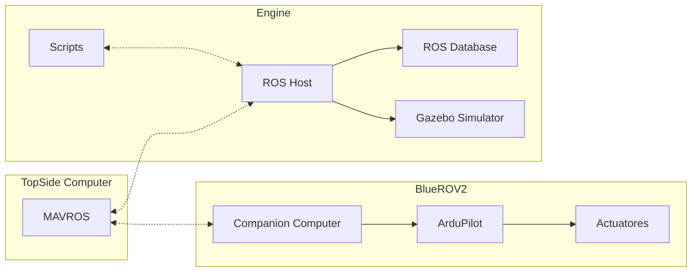
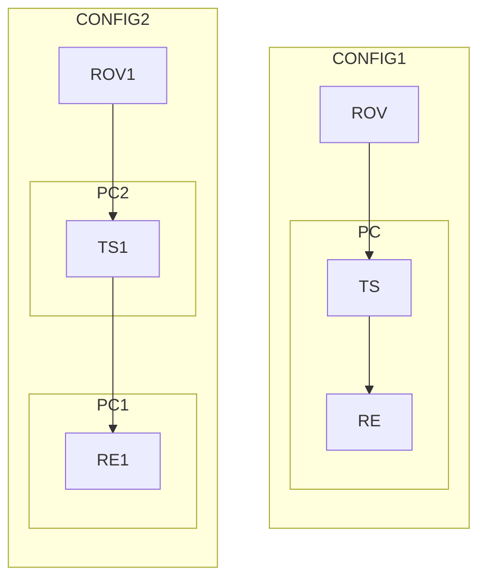

#  Arquitetura De Software e Integraçao 

Esta àrea de trabalho foi liderada por Martinho Figueiredo.

# Objectivos

Esta area tevo como objectivo:
   - Criar um ambiente de desemvolvimento grafico  
   - Criar um sistemas para rercolhar e distribuicao de dados de sensores
   
# Metodologia

## Introducao

Para atigir os objectivos propostos foram avaliados os requisitos:
- Funcionais:
	- Ambiente Grafico para Visualizar resultados
	- Capacidade de Gravar Ensaios
	- Flexibilidade de Distribuicao do ambiente final
- Nao Funcionais:
	- Tempo de atraso
	- Acrescimo de processamento

###  Montagem Fisica

### Recolha e Distribuicao de dados de Sensores

De modo interagir com o ROV, foi necessario estudar os protocolos de comunicacao disponibilizados por este, e conceber um sistema que distribui estes dados em simultaneo aos variados scripts criados, para os monitirizar e modificar. A simultaneidade destes processos necessita de uma camada agregadora que orquestra o fluxo da informacao e, com esse intuito, escolhemos uma arquitectura baseada no Robot Operating System (ROS).Esta ferramenta consiste num modelo publisher-subscriber, em que varios processos estao associados a um objecto, que e a repressentacao digital do estado do ROV. Os processos do tipo publisher servem para actualizar o modelo com informacao em tempo real do robot. Quando estes acabam de o fazer, os processos subscriber sao notificados, para que possam processar esta nova informacao e criar os seus resultados, sejam estes comandos de movimento ou valores numericos de estimativas  de  posicao. Este mecanismo garante alguma coesao temporal, pois sincroniza todos os processos com a chegada de nova informacao. Com este formato em mente, fizemos uso de uma blioteca do ambiente ROS, MAVROS, que funciona como publisher no nosso sistema. 

### Ambiente Grafico

O ambiente grafico permite traduzir o resultado das medidas efectuadas por todos os sensores numa representacao digital do ambiente em que o ROV se encontra. Este objectivo foi solucionado com a ferramenta Gazebo que e um  simulador 3d para robotica que nos permitiu incluir um  modelo 3d do submarino e da piscina criando assim uma representaccccao do nosso ambiente de teste

TODO:INSTERTIMAGES

Esta 

Para facilitar os testes neste ambiente de desenvolvimento vamos usar a ferramenta docker para a distribuiçao e instalação da infrastrutura.

Para isso vamos criar 2 containers:
	- O container para o topside computer, com MAVROS para puder comunicar com o Ros host e passar os dados que recebe atraves da porta ethernet fisica
	- Um container com o software necessario para:
		- executar o servidor de ros
		- front end de gazebo
		- servidor de VNC na web

Separar assim os serviços necessarios permite nos ter acesso a mais configuraçoes de hardware.

# Docker Setup

Following [ref$^1$](https://roboticseabass.com/2021/04/21/docker-and-ros/), our working enviroment will be made of the following docker images:
- `nvidia_ros` 

| |Refs|
|-|-|
|1|[Docker And ROS](https://roboticseabass.com/2021/04/21/docker-and-ros/)|
|2|[ROS](https://ros.org)|
|3|[ROS and Pixhawk](https://docs.px4.io/v1.12/en/robotics/)|
|4|[3d MAPs from sensor data](https://docs.px4.io/v1.12/en/simulation/gazebo_octomap.html)|
