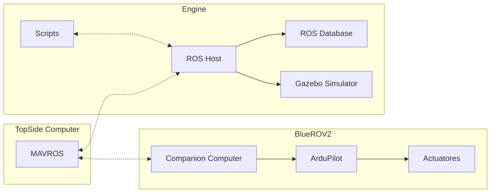
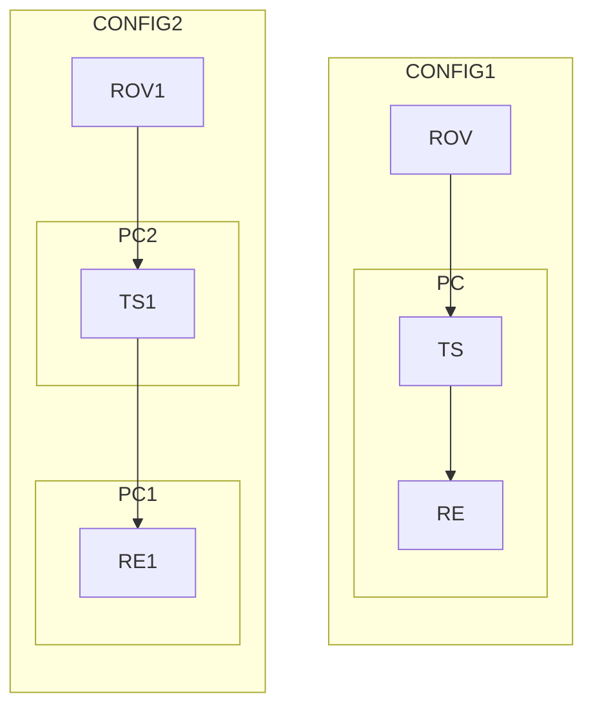

# Notas

Para Facilititar a distribuição de informação recebida do ROV, a arquitectura que escolhemos usar, baseia-se num modelo de _publisher-subscriber_ do ROS o em que o topside computer recebe os dados atraves do cabo ethernet fisico ligado ao ROV. Esta comunicação é feita atraves do protocolo MAVLINK. Visto que tencionamos processar estes dados de forma paralela e usar as bibliotecas do ROS, o primeiro passo sera ingerir os dados todos do mavlink e publicar los na DB do ROS. isto sera feito com a biblioteca mavros.

Para facilitar os testes neste ambiente de desenvolvimento vamos usar a ferramenta docker para a distribuiçao e instalação da infrastrutura.

Para isso vamos criar 2 containers:
	- O container para o topside computer, com MAVROS para puder comunicar com o Ros host e passar os dados que recebe atraves da porta ethernet fisica
	- Um container com o software necessario para:
		- executar o servidor de ros
		- front end de gazebo
		- servidor de VNC na web

Separar assim os serviços necessarios permite nos ter acesso a mais configuraçoes de hardware.

|Refs|
|-|
|[Docker And ROS](https://roboticseabass.com/2021/04/21/docker-and-ros/)|
|[ROS](https://ros.org)|